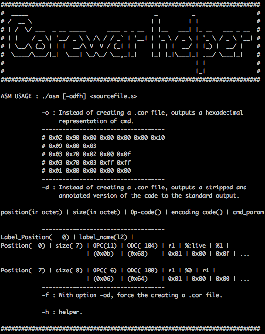
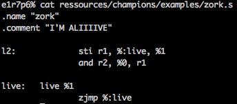
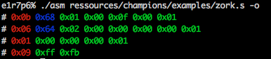
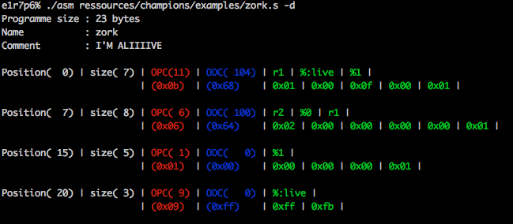
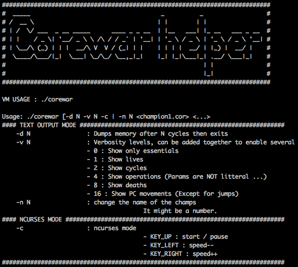
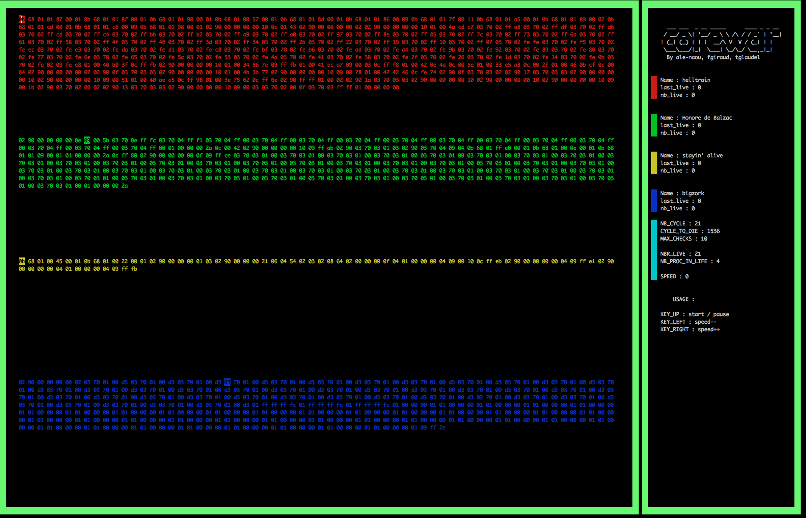
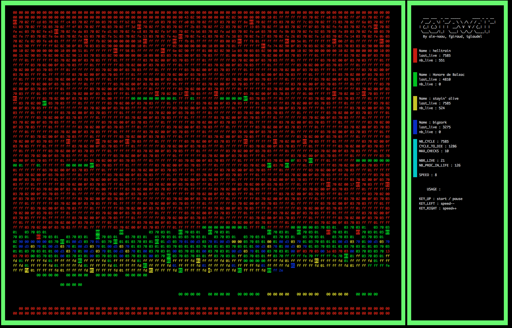

# Corewar

Projet 1 mois, groupe de 3.

Ce projet a pour but de nous faire réaliser une "arène" virtuelle dans laquelle
vont s’affronter des programmes (les "champions"). Nous allons également réaliser un
assembleur permettant de compiler ces champions, ainsi qu’un champion.

Pour une meilleure compréhension de la suite, je vous conseil de lire le README/README_FR.txt.

# l'ASM

A partir d'un code pseudo assembleur, nous devons créer un fichier contenant ce code
sous forme hexadecimal.

Usage :

Code ASM :

Code hexa option -o:

Code hexa option -d:

Les sorties hexadecimal ci-dessus décrivent le champion zork.

# La VM

Il est maintenant temps de faire s'affronter les champions. La machine virtuel va avoir le fonctionnement definie dans README/README_FR.txt.

Usage :

interface graphique NCURSES :

