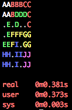
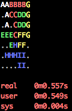

# Fillit 

Groupe de 2.

Fillit est un projet vous permettant de decouvrir et/ou de vous familiariser avec une problematique récurrente en programmation,
la recherche d’une solution optimale parmi un très grand nombre de possibilités, dans un délai raisonable.

Il s’agira d’agencer des Tetriminos entre eux et de déterminer le plus petit carré possible pouvant les acueillir.

Un Tetriminos est une figure géométrique formée de 4 blocs que vous connaissez grâce au célèbre jeu Tetris.

  
