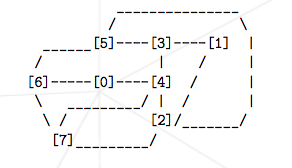
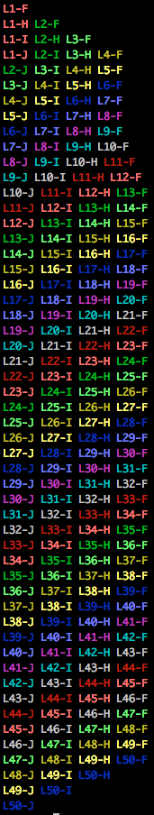

# Lemin

Sur la base du jeu de Hex, il s’agit de trouver le chemin le plus optimal (le chemin le plus court) 
dans une fourmilière pour amener les fourmis d’un point A à un point B.
Implémentation d’un algorithme de pathfinding.

exemple de fourmilière :

déplacement de 50 fourmis dans cette fourmilière :

