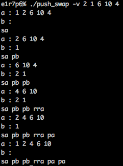

# push_swap

En disposant de deux pile, le but était de trier les arguments données au programme dans l'entrée standard.

Nous disposions des opérations suivante :

* sa : swap a - intervertit les 2 premiers éléments au sommet de la pile a.
  (ne fait rien s’il n’y en a qu’un ou aucun).
* sb : swap b - intervertit les 2 premiers éléments au sommet de la pile b.
  (ne fait rien s’il n’y en a qu’un ou aucun).
* ss : sa et sb en même temps.
* pa : push a - prend le premier élément au sommet de b et le met sur a.
  (ne fait rien si b est vide).
* pb : push b - prend le premier élément au sommet de a et le met sur b.
  (ne fait rien si a est vide).
* ra : rotate a - décale d’une position tous les élements de la pile a.
  (vers le haut, le premier élément devient le dernier).
* rb : rotate b - décale d’une position tous les élements de la pile b.
  (vers le haut, le premier élément devient le dernier).
* rr : ra et rb en meme temps.
* rra : reverse rotate a
  (vers le bas, le dernier élément devient le premier).
* rrb : reverse rotate b
  (vers le bas, le dernier élément devient le premier).
* rrr : rra et rrb en même temps.

exemple :

